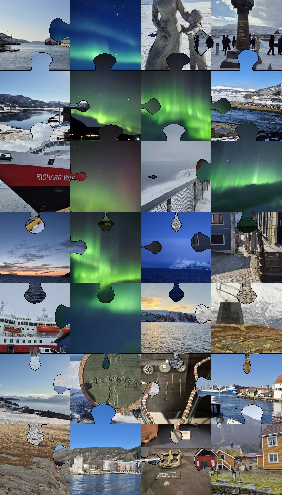

# puzzle_patchwork

Assemble a **jigsaw-style photo mosaic** from a folder of images.  
Every tile is shaped like a real puzzle piece using cubic-Bézier geometry,
images are never repeated, original colour-space is preserved, and
all piece boundaries render as clean single-pixel cut lines with zero mismatch.

---

## Sample output



*Generated with `--cols 5 --rows 8 --tile 450` from the photos in `photos/`*

---

## Repository structure

```
puzzle_patchwork/
├── code/
│   ├── puzzle_patchwork.py   # Main mosaic generator
│   └── resize_photos.py      # Pre-processing helper (resize + rename)
├── photos/                   # Sample input images
├── patchwork.jpg             # Sample output
├── LICENSE
└── README.md
```

---

## Requirements

```
Python ≥ 3.10
Pillow
numpy
```

```bash
pip install Pillow numpy
```

---

## Workflow

### Step 1 — Prepare your photos (optional)

Use `resize_photos.py` to normalise a folder of images before generating
the mosaic — reduces file size, fixes EXIF orientation, and renames files
to a clean numeric sequence.

```bash
python code/resize_photos.py -i ./my_photos -o ./photos
```

| Argument | Default | Description |
|---|---|---|
| `--input` / `-i` | *(required)* | Source folder |
| `--output` / `-o` | in-place | Destination folder (omit to overwrite) |
| `--max-kb` | `500` | Maximum file size in KB |

After this step every file in `photos/` will be `1.jpg`, `2.jpg`, … and
under 500 KB, with EXIF orientation already baked in.

---

### Step 2 — Generate the mosaic

```bash
python code/puzzle_patchwork.py -i ./photos -o patchwork.jpg --cols 5 --rows 8 --tile 450
```

| Argument | Short | Default | Description |
|---|---|---|---|
| `--input` | `-i` | *(required)* | Folder containing source images (scanned recursively) |
| `--output` | `-o` | `patchwork.jpg` | Output file (`.jpg` or `.png`) |
| `--cols` | | `6` | Number of columns |
| `--rows` | | `5` | Number of rows |
| `--tile` | | `180` | Tile size in pixels (square) |
| `--gray-ratio` | | `0.0` | Fraction of tiles to desaturate, 0–1 |
| `--seed` | | *random* | Integer seed for reproducibility |
| `--bg` | | `121212` | Background hex colour |

### More examples

```bash
# Reproducible run, 30 % grayscale tiles mixed in
python code/puzzle_patchwork.py -i ./photos -o patchwork.png \
    --cols 6 --rows 5 --tile 300 --gray-ratio 0.30 --seed 42

# Warm dark background
python code/puzzle_patchwork.py -i ./photos -o warm.jpg \
    --cols 4 --rows 4 --tile 400 --bg 1a0808 --seed 7
```

---

## How it works

### Piece geometry

Each edge is built from **8 cubic-Bézier segments** that reproduce the
classic jigsaw tab silhouette — shoulder S-curves, a narrow neck, and
an elliptical head:

```
         ╭──────╮
        /        \       ← elliptical head
────────┘          └──────   ← S-curve shoulders + neck pinch
```

Per-edge parameters (tab centre offset, neck width, head radius, lean)
are randomised from a **shared seed** so the tab of tile A and the
blank of tile B are always the exact same curve.

### Rendering pipeline

| Pass | Operation | Purpose |
|---|---|---|
| **1** | Full rectangles for every tile | Every pixel filled — blanks reveal the neighbour's image |
| **2** | Shaped piece composited (alpha mask) | Clips to puzzle outline; tabs protrude into neighbour zone |
| **3** | Single-pixel cut lines | Derived from tile-ownership map; guaranteed no doubles or gaps |

### Pixel-perfect cut lines

A `tmap` integer array records which tile owns each canvas pixel.
The boundary is detected as adjacent pixels with different tile indices:

```python
h_boundary = tmap[y, x] != tmap[y+1, x]
v_boundary = tmap[y, x] != tmap[y, x+1]
```

Pure integer comparison — no floating-point geometry, no misalignment possible.

### Zero-halo guarantee

`tiles_rect` (pass 1 rectangle) is derived by centre-cropping `tiles_pad`
(the larger padded image used in pass 2), not by independently re-scaling
the source. Both passes use **identical pixels** at shared boundaries,
so there is no colour fringe around tabs.

---

## Notes

- **No repeated images.** If the grid needs more tiles than available images
  the grid is automatically reduced to the largest `cols × rows` that fits,
  with a warning printed.
- **EXIF orientation** is respected (`ImageOps.exif_transpose`), so portrait
  photos taken on phones appear correctly.
- **Supported input formats:** JPEG, PNG, BMP, TIFF, WebP.
- Output is a single flat RGB image saved at JPEG quality 95 or lossless PNG.

---

## License

MIT
